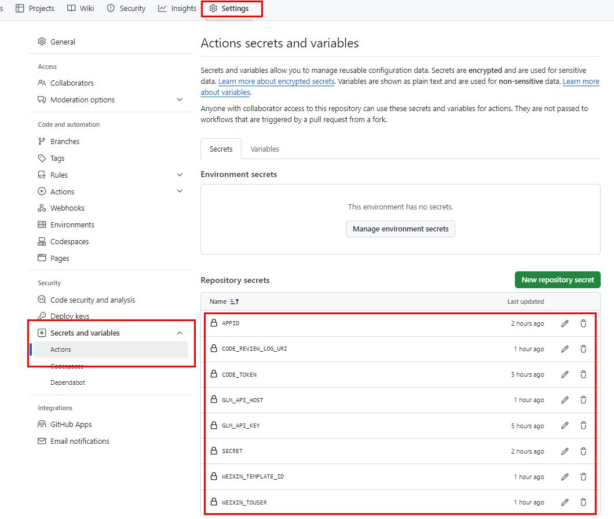
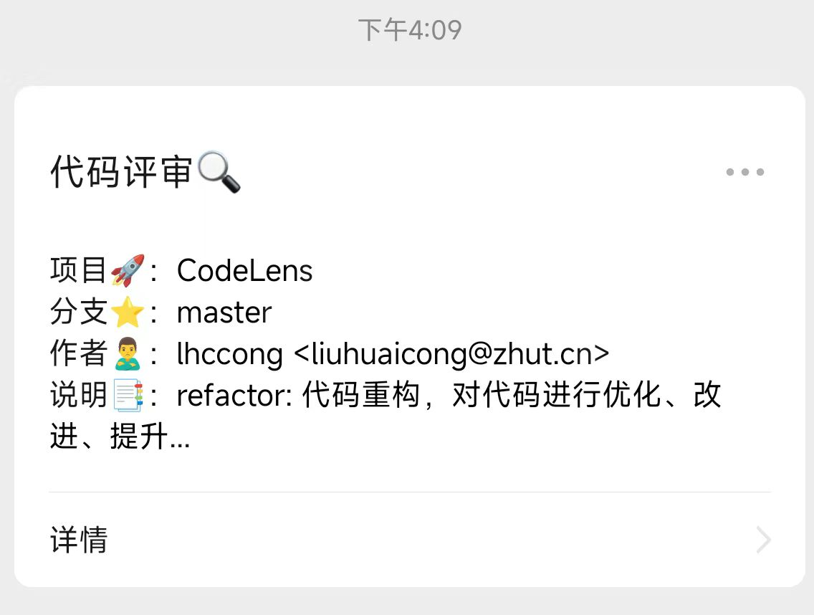
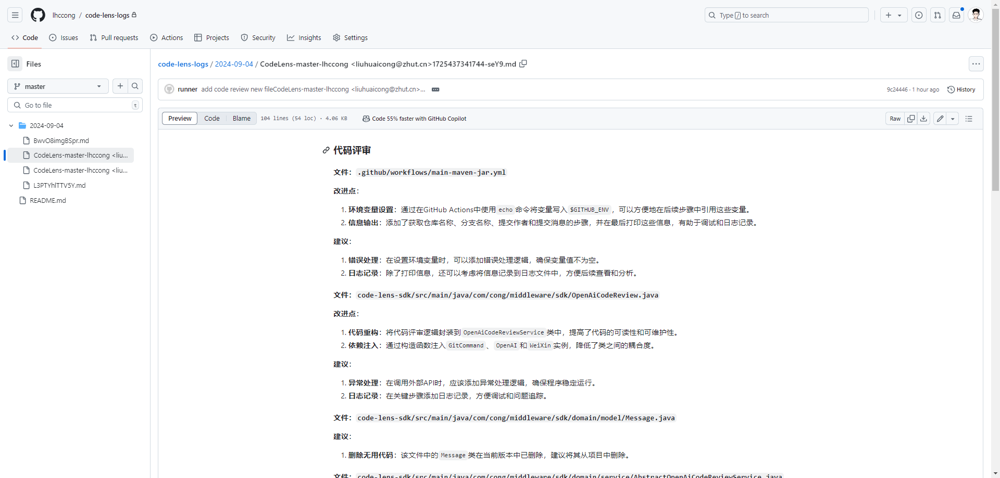

<h1 align="center">代码透镜🔍</h1>
<p align="center"><strong>一款基于 AI 的代码评审工具，让你的代码漏洞无所遁形。<em>持续更新中～</em></strong></p>
<div align="center">
    <a href="https://github.com/lhccong/CodeLens"></a>
</div>


## 背景

能在代码提交后，通过 AI 分析代码，找出代码中漏洞，并给出详细的分析报告，是提升代码质量的有效手段。

### 功能：
1. 代码提交后，自动触发代码分析，并给出详细的分析报告。
2. 分析报告中包含代码中存在的 SQL 注入、XSS 攻击、命令执行、敏感信息泄露等漏洞。

## 快速开始🌈

### 使用方法

#### 1、引入 github action 到项目中
在项目的根目录下，创建 `.github/workflows/main-remote-jar.yml` 文件，并添加以下内容：
```yaml
name: Build and Run CodeLens By Main Maven Jar

on:
  push:
    branches:
      - master
  pull_request:
    branches:
      - master

jobs:
  build:
    runs-on: ubuntu-latest

    steps:
      - name: Checkout repository
        uses: actions/checkout@v2
        with:
          fetch-depth: 2

      - name: Set up JDK 11
        uses: actions/setup-java@v2
        with:
          distribution: 'adopt'
          java-version: '11'

      - name: Create libs directory
        run: mkdir -p ./libs

      - name: Download openai-code-review-sdk JAR
        run: wget -O ./libs/code-lens-sdk-1.0.jar https://github.com/lhccong/CodeLens/releases/download/v1.0/code-lens-sdk-1.0.jar

      - name: Get repository name
        id: repo-name
        run: echo "REPO_NAME=${GITHUB_REPOSITORY##*/}" >> $GITHUB_ENV

      - name: Get branch name
        id: branch-name
        run: echo "BRANCH_NAME=${GITHUB_REF#refs/heads/}" >> $GITHUB_ENV

      - name: Get commit author
        id: commit-author
        run: echo "COMMIT_AUTHOR=$(git log -1 --pretty=format:'%an <%ae>')" >> $GITHUB_ENV

      - name: Get commit message
        id: commit-message
        run: echo "COMMIT_MESSAGE=$(git log -1 --pretty=format:'%s')" >> $GITHUB_ENV

      - name: Print repository, branch name, commit author, and commit message
        run: |
          echo "Repository name is ${{ env.REPO_NAME }}"
          echo "Branch name is ${{ env.BRANCH_NAME }}"
          echo "Commit author is ${{ env.COMMIT_AUTHOR }}"
          echo "Commit message is ${{ env.COMMIT_MESSAGE }}"      

      - name: Run Code Review
        run: java -jar ./libs/code-lens-sdk-1.0.jar
        env:
          # Github 配置；GITHUB_REVIEW_LOG_URI「https://github.com/xfg-studio-project/openai-code-review-log」、GITHUB_TOKEN「https://github.com/settings/tokens」
          GITHUB_TOKEN: ${{ secrets.CODE_TOKEN }}
          GITHUB_REVIEW_LOG_URI: ${{ secrets.CODE_REVIEW_LOG_URI }}
          COMMIT_PROJECT: ${{ env.REPO_NAME }}
          COMMIT_BRANCH: ${{ env.BRANCH_NAME }}
          COMMIT_AUTHOR: ${{ env.COMMIT_AUTHOR }}
          COMMIT_MESSAGE: ${{ env.COMMIT_MESSAGE }}
          # 微信配置 「https://mp.weixin.qq.com/debug/cgi-bin/sandboxinfo?action=showinfo&t=sandbox/index」
          SECRET: ${{ secrets.SECRET }}
          APPID: ${{ secrets.APPID }}
          WEIXIN_TOUSER: ${{ secrets.WEIXIN_TOUSER }}
          WEIXIN_TEMPLATE_ID: ${{ secrets.WEIXIN_TEMPLATE_ID }}
          # OpenAi - ChatGLM 配置「https://open.bigmodel.cn/api/paas/v4/chat/completions」、「https://open.bigmodel.cn/usercenter/apikeys」
          GLM_API_HOST: ${{ secrets.GLM_API_HOST }}
          GLM_API_KEY: ${{ secrets.GLM_API_KEY }}

```


#### 2、微信公众号配置

在微信公众号后台，添加 `消息模版`，并配置好模版 ID，并将模版 ID 填入 `WEIXIN_TEMPLATE_ID` 变量中。

#### 3、OpenAi - ChatGLM 配置

在 OpenAi - ChatGLM 平台，创建 API Key，并将 API Key 填入 `GLM_API_KEY` 变量中。

#### 4、github 环境变量

在项目的 `Settings` -> `Secrets and variables` 中 的 `Actions`，添加以下环境变量：



- APPID⭐：微信公众号 APPID
- SECRET⭐：微信公众号 Secret
- WEIXIN_TOUSER⭐：微信公众号接收消息的用户
- WEIXIN_TEMPLATE_ID⭐：微信公众号消息模板 ID
- GLM_API_HOST⭐：OpenAi - ChatGLM API 地址
- GLM_API_KEY⭐：OpenAi - ChatGLM API Key
- CODE_TOKEN⭐：Github Token
- CODE_REVIEW_LOG_URI⭐：Github 代码审查日志地址

#### 5、运行

代码提交后，会自动触发代码分析，并给出详细的分析报告。

## 效果展示

微信通知



代码分析结果会存放在配置的 CODE_REVIEW_LOG_URI 仓库地址中



